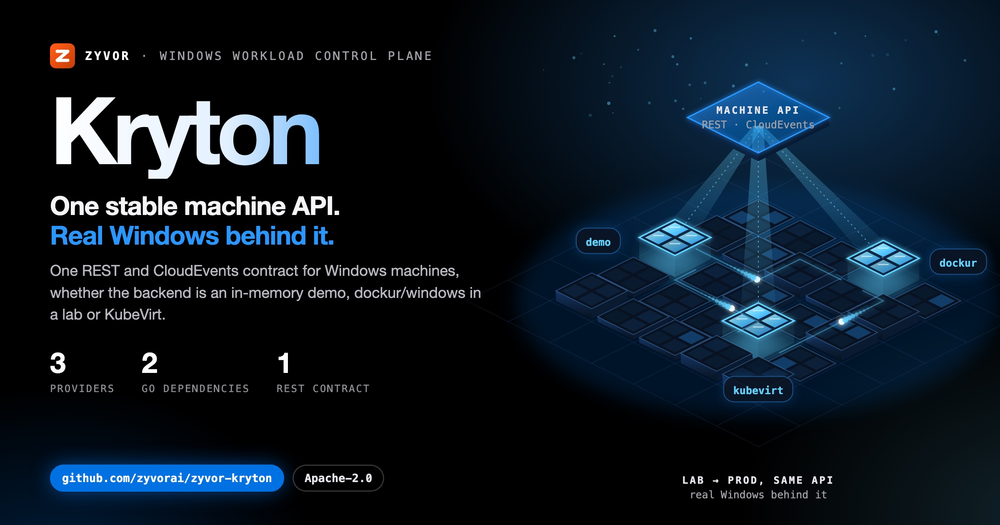
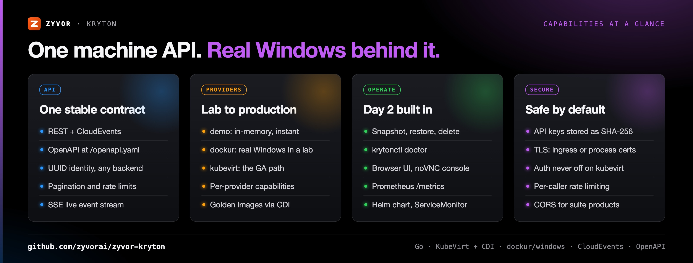
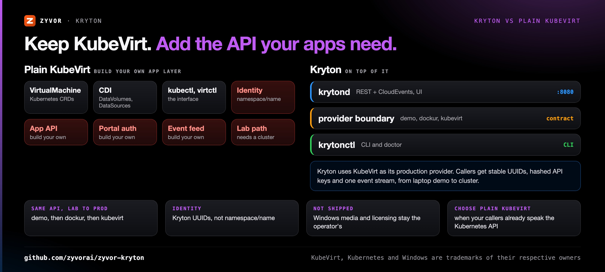
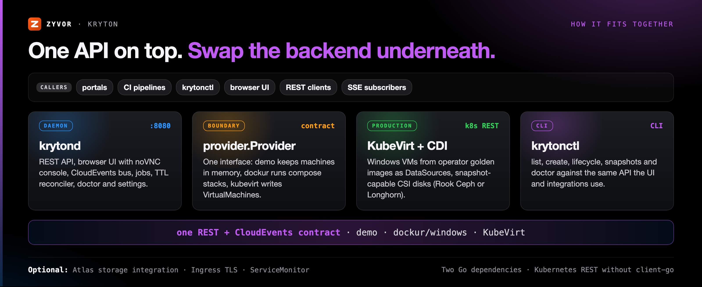

<div align="center">

# Kryton

[](https://github.com/zyvorai/zyvor-kryton/actions/workflows/ci.yml)
[](LICENSE)
[](https://go.dev/)
[](https://pkg.go.dev/github.com/zyvorai/kryton)

[](https://zyvor.dev/schedule?utm_source=github&utm_medium=kryton&utm_campaign=readme_hero)
[](https://zyvor.dev/poc?utm_source=github&utm_medium=kryton&utm_campaign=readme_hero)
[](#quickstart)



### One stable machine API. Real Windows behind it.

**A control plane for Windows workloads.** Portals, CI and automation talk to one REST + CloudEvents contract whether the backend is an in-memory **demo**, real Windows via **[dockur/windows](https://github.com/dockur/windows)** on a lab host, or **KubeVirt** on Kubernetes.

**3 providers, 1 contract** · **REST + CloudEvents + OpenAPI** · **Snapshots on CSI** · **Hashed API keys** · **2 Go dependencies**

📖 **[User guide](docs/USER-GUIDE.md)** · **[Product docs](https://zyvor.dev/docs/kryton?utm_source=github&utm_medium=kryton&utm_campaign=readme_hero)** · **[API](docs/API.md)** · **[GA checklist](docs/GA.md)**

</div>

---

## Linux templates and native libvirt

Kryton also supports six Linux cloud-image templates, Linux cloud-init on KubeVirt,
and a native libvirt lifecycle provider. Use `kryton-image` for checksum-pinned image
acquisition and CDI/libvirt exports. See [Linux setup and test evidence](docs/LINUX-TEMPLATES.md).
Native libvirt is an initial host backend; guest boot certification requires host validation.

## What's new

From [CHANGELOG.md](CHANGELOG.md) (1.1.0 and 1.2.0):

| | |
|---|---|
| **API rate limiting** | `KRYTON_RATE_LIMIT_RPS` / `KRYTON_RATE_LIMIT_BURST`: a per-caller token bucket keyed by API-key name, returning `429` / `RATE_LIMITED`. Off by default. |
| **Pagination** | `GET /api/v1/machines?limit=&cursor=` with `nextCursor`, matching the events API. |
| **Helm for operations** | `serviceMonitor` and `podDisruptionBudget` templates, plus a chart README for every values key and overlay. |
| **KubeVirt production scripts** | `scripts/setup-kubevirt-production.sh` automates golden-image build and CDI bootstrap end to end. |
| **Lab auto-auth** | `KRYTON_LAB_AUTO_AUTH` so shared lab hosts don't need a bearer token pasted per session. |
| **Full dockur options** | `spec.dockur` on create: credentials, locale, AD join, shared folders, custom ISO, secure boot + TPM, extra disks and more. |
| **Console and catalog** | Embedded noVNC console with no CDN dependency, Copy RDP, and 12 dockur catalog images. |

---

## Why Kryton

| When this happens… | Kryton gives you… |
|---|---|
| Every portal, pipeline and script talks to Windows VMs differently | **One REST + CloudEvents contract** with OpenAPI at `/openapi.yaml`, whatever the backend |
| You want to prototype on a laptop and ship on Kubernetes | **Same API, three providers**: `demo` → `dockur` → `kubevirt` |
| Integrations break when a VM moves namespace or gets renamed | **Stable UUID identity**, independent of the provider's own name |
| Raw KubeVirt gives your apps YAML, not an API | **Machines, lifecycle, snapshots, jobs and an SSE event stream** over HTTP |
| Shared credentials for automation make auditors nervous | **API keys stored as SHA-256 digests**, TLS, per-caller rate limits, auth never disabled on `kubevirt` |
| "Is this host ready?" is a half-day of guessing | **`krytonctl doctor`**: auth, catalog, namespaces, DataSources, snapshot CRDs, StorageClass ↔ snapshot class |



---

## Kryton vs plain KubeVirt



Kryton runs **on top of** KubeVirt in production; the question is whether you build the application layer yourself.

| | **Kryton** | **Plain KubeVirt** |
|---|---|---|
| Interface for apps | REST + CloudEvents, OpenAPI | Kubernetes API (`VirtualMachine` CRDs), `kubectl` / `virtctl` |
| Machine identity | Kryton UUID, recorded in labels | `namespace/name` |
| Lab path | `demo` in memory, `dockur` on a single Docker/Podman + KVM host | A Kubernetes cluster with KubeVirt installed |
| Production path | The `kubevirt` provider behind Helm, hashed API keys, TLS | KubeVirt itself |
| Golden images | Catalog IDs mapped to CDI `DataSource` objects, `POST /api/v1/golden/{id}/bootstrap` | CDI `DataVolume` / `DataSource` objects you manage |
| Snapshots | Create, list, restore, delete via API, UI and `krytonctl` | `VirtualMachineSnapshot` / `VirtualMachineRestore` resources |
| Live events | `GET /api/v1/events/stream` (SSE) | Kubernetes watches |
| Console | Embedded noVNC in the browser UI | `virtctl vnc` / external UI |
| **Choose plain KubeVirt when** | | Your callers already speak the Kubernetes API and don't need a stable, backend-independent machine API |

### Is this for you?

| | **Kryton** | VMware/Citrix VDI | Windows Admin Center | Plain KubeVirt |
|---|---|---|---|---|
| Scope | Stable machine API over interchangeable backends | Full VDI stack | GUI management | Kubernetes VM CRDs |
| API-first | REST + CloudEvents | Proprietary | GUI-first | Kubernetes API |
| Windows media | Not shipped — operator's job | Vendor-licensed | N/A | Not shipped |
| Lab → prod | Same API: `demo` → `dockur` → `kubevirt` | Separate tooling | N/A | Build your own app layer |

---

## How it fits together



Kryton is deliberately split at the **provider boundary**. Callers see one stable machine API; providers translate it into demo state, dockur compose stacks, or KubeVirt VirtualMachines. Details: [docs/ARCHITECTURE.md](docs/ARCHITECTURE.md).

```text
  Veyron / Zeus / Atlas / Haven / Axiom / CI
                    │
             REST + CloudEvents
                    │
                 Kryton
           demo │ dockur │ kubevirt
```

### How to use Kryton

Full walkthroughs: **[docs/USER-GUIDE.md](docs/USER-GUIDE.md)**.

| You are… | Do this | Provider | Auth |
|----------|---------|----------|------|
| Trying locally | `make demo` → `:8080` | `demo` | off |
| Real Windows in a lab | [Remote deploy](#remote-deploy) + [dockur](#dockur-lab-provider) | `dockur` | apikey |
| Production K8s | [Golden image](docs/GOLDEN-IMAGES.md) + [KubeVirt](#kubevirt-windows-vms) + Helm | `kubevirt` | apikey + TLS |
| Portal / CI | [API](#api) + `KRYTON_TOKEN` | any | apikey |

---

## Quickstart

Requires **Go 1.27.1+**.

```bash
git clone https://github.com/zyvorai/zyvor-kryton.git && cd kryton
make demo
```

Open [http://localhost:8080](http://localhost:8080). Local demo uses `demo` provider with auth **disabled** — evaluation only.

```bash
go run ./cmd/krytonctl list
go run ./cmd/krytonctl create win-dev-01
go run ./cmd/krytonctl doctor
```

New here? [`docs/FAQ.md`](docs/FAQ.md) · troubleshooting in [USER-GUIDE](docs/USER-GUIDE.md#troubleshooting), [AUTH](docs/AUTH.md#troubleshooting), [KUBEVIRT](docs/KUBEVIRT.md#troubleshooting)

## Install

```bash
make build
sudo install -m755 bin/krytond bin/krytonctl /usr/local/bin/
```

Container: `docker build -t kryton:dev .` with `KRYTON_PROVIDER=demo`, `KRYTON_AUTH_MODE=disabled`, `KRYTON_ALLOW_INSECURE=true`.

| Target | What it does |
|--------|----------------|
| `make check` | fmt · test · vet · build |
| `make deploy-remote H=… U=…` | SSH deploy — [DEPLOY-REMOTE.md](docs/DEPLOY-REMOTE.md) |
| `make setup-kubevirt-production BUILD=1` | Golden + CDI + API + VM |

## KubeVirt Windows VMs

```bash
VERSION=11e ./scripts/build-golden-image.sh
export KRYTON_WINDOWS_IMAGE=./out/windows-11e-golden.qcow2
./scripts/setup-kubevirt.sh
```

See **[docs/KUBEVIRT.md](docs/KUBEVIRT.md)** and **[docs/GOLDEN-IMAGES.md](docs/GOLDEN-IMAGES.md)**.

## Remote deploy

```bash
make deploy-remote H=<host> U=<user> ARGS='--quick --key'
```

## Dockur lab provider

```bash
export KRYTON_PROVIDER=dockur
export KRYTON_DOCKUR_PUBLIC_HOST=<your-host-ip>
krytonctl create --image windows-11-enterprise --cpu 4 --memory 8192 lab-win01
```

See **[docs/DOCKUR.md](docs/DOCKUR.md)**.

## Helm (KubeVirt)

Production: KubeVirt + CDI, administrator `DataSource` objects, API-key auth. See **[docs/DEPLOYMENT.md](docs/DEPLOYMENT.md)** and `deploy/helm/kryton/README.md`.

**Authentication:** `./scripts/ensure-api-keys.sh` → `~/.kryton/lab.token`. Full guide: **[docs/AUTH.md](docs/AUTH.md)**.

## API

Discovery at `GET /api/v1`; machines at `GET/POST /api/v1/machines`; lifecycle, snapshots, events stream. OpenAPI: [`openapi.yaml`](openapi.yaml) and `/openapi.yaml`. Contract: **[docs/API.md](docs/API.md)**.

Configuration highlights: `KRYTON_PROVIDER`, `KRYTON_AUTH_MODE`, `KRYTON_ADDR`, `KRYTON_KUBECONFIG`, `KRYTON_STORAGE_CLASS`, `KRYTON_CORS_ORIGINS`, rate limits — full table in prior docs or `internal/config`.

## Development

```bash
make check && make test && make race && make vet
```

CI runs license headers, golangci-lint, govulncheck, gosec, tests, multi-arch `ghcr.io/zyvorai/kryton` publish. **[CONTRIBUTING.md](CONTRIBUTING.md)**.

## What Kryton is not

Not a Windows installer, activation service, or media distributor. Microsoft licensing remains the **operator's** responsibility.

## Docs

| Doc | Topic |
|-----|--------|
| **[USER-GUIDE.md](docs/USER-GUIDE.md)** | All personas — start here |
| [docs/README.md](docs/README.md) | Index |
| [GA.md](docs/GA.md) | Production checklist |
| [ARCHITECTURE.md](docs/ARCHITECTURE.md) | Provider boundary |
| [SECURITY.md](SECURITY.md) | Reporting |

Share cards: `./docs/social/build-social-card.sh`

---

## Maturity

> **Maturity (honest):** [`docs/GA.md`](docs/GA.md) is the production checklist — **`dockur` remains a lab installer, not GA**; multi-replica `krytond` is explicitly out of GA scope (single-writer reconciler, in-process event bus). **KubeVirt is the GA path.**

| Area | Status |
|---|---|
| `kubevirt` provider behind Helm, API keys and TLS | GA path |
| `dockur` provider | Lab installer, not GA (no dockur snapshots) |
| `demo` provider | Evaluation only, in-memory |
| Multiple `krytond` replicas | Out of GA scope (`replicaCount: 1`) |
| Live migration of the guest VM | Out of GA scope |

---

## Part of the Zyvor stack

| Product | Role next to Kryton |
|---|---|
| **Kryton** | Windows workload control plane: one machine API over demo, dockur and KubeVirt |
| **[Atlas](https://github.com/zyvorai/zyvor-atlas)** | Storage control plane; Kryton integrates via Settings → Integrations ([docs/ATLAS.md](docs/ATLAS.md)) |
| **[Haven](https://github.com/zyvorai/zyvor-haven)** | A suite product Kryton's CORS support is designed for, so its browser UI can call Kryton |
| **[Kairon](https://github.com/zyvorai/zyvor-kairon)** | Next to Kryton: VMs on Kubernetes without KubeVirt, including Windows guests |

→ [zyvor.dev](https://zyvor.dev)

---

## License

Kryton is **free and open source** under the [Apache License 2.0](LICENSE) (see [NOTICE](NOTICE)). That does not change.

**Zyvor Enterprise** adds what production teams ask for: supported releases, deployment and upgrade guidance, priority incident triage, a named technical contact and 24x7 critical intake. Plans and terms: [docs/SUBSCRIPTION-MODEL.md](docs/SUBSCRIPTION-MODEL.md) · [Pricing](https://zyvor.dev/pricing?utm_source=github&utm_medium=kryton&utm_campaign=readme_license) · [sales@zyvor.dev](mailto:sales@zyvor.dev).

Report vulnerabilities per [SECURITY.md](SECURITY.md). Contributions: [CONTRIBUTING.md](CONTRIBUTING.md).

---

<div align="center">

### Give your Windows estate one API

[](https://zyvor.dev/schedule?utm_source=github&utm_medium=kryton&utm_campaign=readme_footer)
[](https://zyvor.dev/poc?utm_source=github&utm_medium=kryton&utm_campaign=readme_footer)
[](https://zyvor.dev/pricing?utm_source=github&utm_medium=kryton&utm_campaign=readme_footer)
[](mailto:sales@zyvor.dev?subject=Kryton)
[](https://github.com/zyvorai/zyvor-kryton)

</div>
